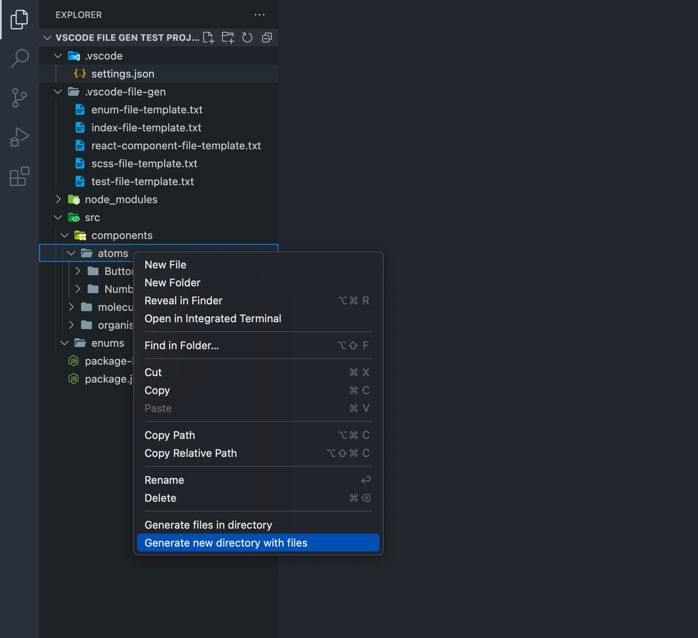
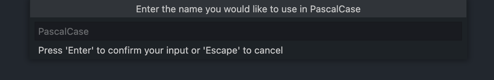
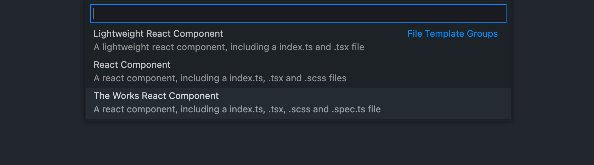
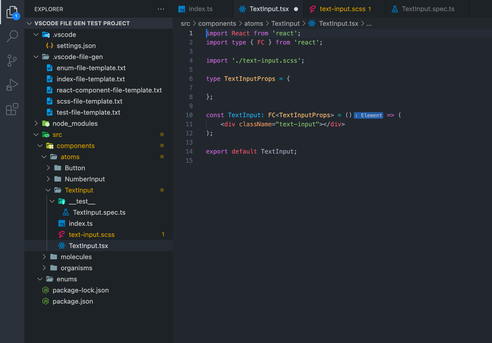

# vscode-file-gen README

vscode-file-gen allows you to generate colections of files based on user defined templates.

## How to use vscode-file-gen

### Step 1
Once the required extension settings have been set, right click on a folder in the vscode file explorer. There will be two options, the first is the generate files in the selected directory, the second is to create a new directory at tghe selected location. For this example I'll be selecting option two.



### Step 2
A dialog box will open, this is where you can enter the name you would like to use for the file generation in the casing format you specified in the extension settings. For this example I'll be entering "TextInput".



### Step 3
Next a picker will open allowing you to select the template/template group that you would like to use. For this example I'll be selecting "The Works React Component".



### Step 4
As you can now see, all our files have been generated and the files have been automatically opened in our editor! 



The extension config that I used for this example is as follows:
```json
{
  "vscode-file-gen.directory-name-casing": "PascalCase",
  "vscode-file-gen.only-show-template-groups-in-picker": true,
  "vscode-file-gen.file-template-groups": [
    {
      "name": "Lightweight React Component",
      "description": "A lightweight react component, including a index.ts and .tsx file",
      "fileTemplates": ["Index", "React Component"]
    },
    {
      "name": "React Component",
      "description": "A react component, including a index.ts, .tsx and .scss files",
      "fileTemplates": ["Index", "React Component", "SCSS"]
    },
    {
      "name": "The Works React Component",
      "description": "A react component, including a index.ts, .tsx, .scss and .spec.ts file",
      "fileTemplates": ["Index", "React Component", "SCSS", "Test"]
    }
  ],
  "vscode-file-gen.file-templates": [
    {
      "name": "Enum",
      "fileName": "&{{PASCAL_CASE}}&.ts",
      "templateFilePath": ".vscode-file-gen/enum-file-template.txt"
    },
    {
      "name": "Index",
      "fileName": "index.ts",
      "templateFilePath": ".vscode-file-gen/index-file-template.txt"
    },
    {
      "name": "React Component",
      "fileName": "&{{PASCAL_CASE}}&.tsx",
      "templateFilePath": ".vscode-file-gen/react-component-file-template.txt"
    },
    {
      "name": "SCSS",
      "fileName": "&{{KEBAB_CASE}}&.scss",
      "templateFilePath": ".vscode-file-gen/scss-file-template.txt"
    },
    {
      "name": "Test",
      "fileName": "__test__/&{{PASCAL_CASE}}&.spec.ts",
      "templateFilePath": ".vscode-file-gen/test-file-template.txt"
    }
  ]
}
```

## Extension Settings

This extension contributes the following settings:

### `vscode-file-gen.directory-name-casing`:
**Description:** This defines the casing format you would like to use when entering the name to generate files from.

**Options:** `"camelCase" | "PascalCase" | "snake_case" | "kebab-case"`

### `vscode-file-gen.only-show-template-groups-in-picker` (optional):
**Description:** This controls wheter or not both templates and template groups are both shown in the picker.

**Options:** `true | false`

**Default:** `false`

### `vscode-file-gen.file-template-groups`:
**Description:** 

**Options:**
```js
[
  {
    name: string, // The name of the template group (this must be unique!)
    description: string | null, // The description of the template group (optional)
    fileTemplates: string[], // A list of template names to generate for this group
  }
]
```

### `vscode-file-gen.file-templates`:
**Description:** This defines the casing format you would like to use when entering the name to generate files from.

**Options:**
```js
[
  {
    name: string, // The name of the template (this must be unique!)
    description: string | null, // The description of the template group (optional)
    // The file name to generate, this can include template strings
    // and be prefixed with one level of sub directory
    fileName: string,
    // The path to the template file, this path should be relative to the workspace root
    templateFilePath: string,
  }
]
```

## Template files
A template file is a text file (it should have a `.txt` file extension) that defines to contents to be generated when generating the file.

The following template strings are currently supported:
- `&{{CAMEL_CASE}}&` - Will be replaced with the name you entered in camelCase.
- `&{{PASCAL_CASE}}&` - Will be replaced with the name you entered in PascalCase.
- `&{{SNAKE_CASE}}&` - Will be replaced with the name you entered in snake_case.
- `&{{KEBAB_CASE}}&` - Will be replaced with the name you entered in kebab-case.

So for example, this template:
```
import React from 'react';
import type { FC } from 'react';

import './&{{KEBAB_CASE}}&.scss';

type &{{PASCAL_CASE}}&Props = {

};

// I'm trying to find a use for snake_case so here: &{{SNAKE_CASE}}&
// And for camelCase so here: &{{CAMEL_CASE}}&
const &{{PASCAL_CASE}}&: FC<&{{PASCAL_CASE}}&Props> = () => (
    <div className="&{{KEBAB_CASE}}&"></div>
);

export default &{{PASCAL_CASE}}&;
```

Would generate the following output if a name of "TextInput" was provided at the earlier step:
```
import React from 'react';
import type { FC } from 'react';

import './text-input.scss';

type TextInputProps = {

};

// I'm trying to find a use for snake_case so here: text_input
// And for camelCase so here: textInput
const TextInput: FC<TextInputProps> = () => (
    <div className="text-input"></div>
);

export default TextInput;
```

## Release Notes

### v0.0.1

Initial release of vscode-file-gen, this includes the most basic set of functionality required to make the extension useful.

- Configuring templates, groups of templates, the casing format you would like to use to create directories and wheter to show templates and template groups or just templates in the picker.
- Generating a new parent directory if required.
- Generating files from the specified templates.
- Generating sub directories and files in sub directories.
