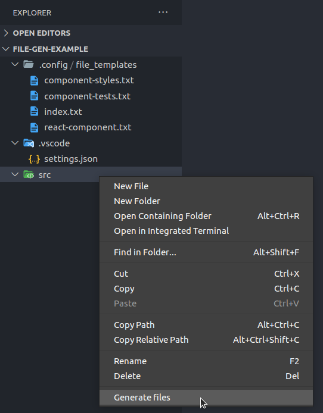
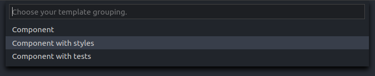
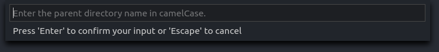
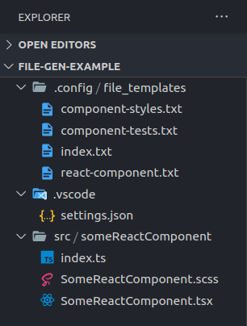

# vscode-file-gen
A VSCode extension for generating sets of files based on user specified templates.

A semi opinionated file generator, aimed at being a language agnostic way of quickly generating sets of files to remove the need to endlessley type out boiler plate code.

If you find any issues, have a feature request or have any question please create an issue on GitHub or submit a PR if appropriate.

##  Configuration steps
For the extension to work there are a few things that must be configured.

### 1. Parent directory name casing
This selects the casing you will use for the directory name you specify and is configured via the `vscode-file-gen.directory-name-casing` setting in `settings.json`, it can be set to any of the following options `camelCase`, `PascalCase`, `snake_case` or `kebab-case`. 

### 2. Define some file templates
These file template files will allow you to define the default contents of the files you'd like to generate and can contain the following template strings that the extension will replace dynamically based on the parent directory name you provide. The supported template strings are as follows `&{CAMEL_CASE}&`, `&{PASCAL_CASE}&`, `&{SNAKE_CASE}&`, `&{KEBAB_CASE}&`.

For example the following file template:

```
import React, { FC } from 'react';

const &{PASCAL_CASE}&: FC = () => (
    <div className="&{KEBAB_CASE}&">
        &{PASCAL_CASE}& Component
    </div>
);

export default &{PASCAL_CASE}&;
```

Would genearate this file:

```tsx
import React, { FC } from 'react';

const SomeComponent: FC = () => (
    <div className="some-component">
        SomeComponent Component
    </div>
);

export default SomeComponent;
```

### 3. File templates you'd like to be able to generate
This specifies the mappings for files that you'd like to be able to generate and is configured by passing of file and is configured via the `vscode-file-gen.file-templates` setting in `settings.json`, it expects an array of objects with the following properties.

- `name`: The name of the file template which will be used to refrence it in the file template groupings.
- `generatedFileName`: The file name of the generated file, this can include the same template strings as the file template file and also supports creating the file in a sub directory if for example the value given was `__TESTS__/component-tests.spec.tsx` (only one sub directory level is supported).
- `fileTemplatePath`: The relative path (from the workspace root) to the file template file.

Example:

```json
{
    "name": "Component",
    "generatedFileName": "&{PASCAL_CASE}&.tsx",
    "fileTemplatePath": ".config/file_templates/react-component.txt"
}
```

### 4. Groupings of file templates
The different groupings of file templates that you'd like to be able to generate are configured using the `vscode-file-gen.file-template-groupings` setting in `settings.json`, it expects an array of objects with the following properties.

- `name`: The name of the grouping, this will be shown in the list of options when generating files.
- `files`: The names of the file templates you'd like to generate, this is the name specified in the last step.

Example:

```json
{
    "name": "Component with styles",
    "files": [ "Index", "Component", "Styles" ]
}
```

## How to use
1. Right click on the directory you'd like to create a directory inside and select "Generate files" from the context menu.



2. Select the file template grouping you'd like to generate from the dropdown list.



3. Enter the name of the parent directory in the casing you specified.



4. The files will be generated and visible in the file explorer.


